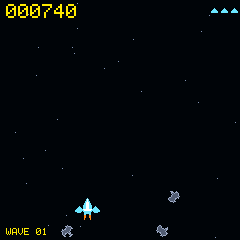
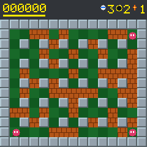
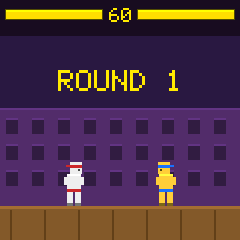
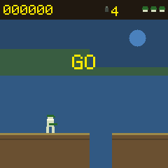
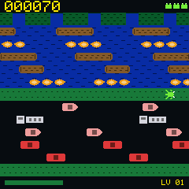
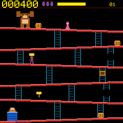
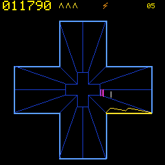

# Arcade Dongle Module 🕹️

A self-playing arcade cabinet for the
[snake dongle](https://github.com/joaopedropio/snake-dongle) hardware: a ZMK
module that turns the dongle's 240x240 ST7789V panel into one of eight
games.  Nobody drives any of them.

**Pac-Man** hunts pellets on his own, runs for a power pellet when he is
cornered and chases the blue ghosts, while the four ghosts use the classic
scatter/chase targeting rules.

**Space Shooter** — after
[the arcade game of that name](https://store.steampowered.com/app/3059240/Space_Shooter/)
— flies a triangle around a starfield under its own power, turning either way
and thrusting along whatever direction it happens to be pointing. It breaks
meteors into smaller meteors, flies around the ones it cannot break in time,
and chases the pickups they leave behind. There is nothing to clear: meteors
keep arriving as fast as they are destroyed.

**Bomberman** — after
[the 1983 game of that name](https://en.wikipedia.org/wiki/Bomberman) — walks a
field of pillars and soft brick, drops bombs that burst in a cross, and gets
out of the way before they do. It picks where to put each one by what the
blast would break, proves a way out before it lets go of it, keeps its distance
from the things wandering the board, and leaves through the door under one of
the bricks once it has cleared them.

**Street Fighter** — after
[the 1991 game of that name](https://en.wikipedia.org/wiki/Street_Fighter_II) —
puts two of them on a stage with a health bar each and a clock over the top,
and lets them get on with it. Both sides run the same pilot off different
numbers, so one match is a nervy long-range fighter against somebody who will
not stop walking forward and the next is two brawlers. The punch, the sweep and
the fireball beat guarding, crouching and jumping in a ring, and none of that
is a table: a punch is chest high and a sweep is along the floor, so a crouch
goes under one and is caught by the other because of where the two rectangles
are.

**Metal Slug** — after
[the 1996 game of that name](https://en.wikipedia.org/wiki/Metal_Slug) — runs a
trooper right along a ridge that never ends, shooting what comes the other way,
putting a grenade on anything standing on a ledge its rifle cannot reach, and
jumping the holes. One hit is one life. It works out when to jump by winding
its own arc forward over the ground in front of it rather than by counting
pixels to the edge, and it leaves the ground as late as it still can.

**Crossing** — after
[Frogger, 1981](https://www.youtube.com/shorts/WbP_oXtiwGA) — hops a frog over
five lanes of traffic and then over a river it can only cross by riding the
logs and turtles drifting along it, until all five bays at the top have a frog
in them. It waits on the banks for a gap, walks along them to a column that
opens, and steers by choosing which current to be in.

**Donkey Kong** — after
[the 1981 game of that name](https://en.wikipedia.org/wiki/Donkey_Kong_(1981_video_game))
— climbs six sloping girders to the top while barrels roll down them, jumping
what it cannot walk away from and taking a hammer to what it cannot jump. The
barrels take the ladders down as often as they run to the end of a girder, so
the way up is never the same twice; the climber prices every move it could make
against every barrel it can see and takes whichever one is worth most, which is
why it will stand still under a hammer rather than walk into a gap that closes.

**Tempest** — after
[the 1980 game of that name](https://en.wikipedia.org/wiki/Tempest_(video_game))
— slides a claw round the rim of a well drawn in perspective, shooting down the
lanes at what climbs up them: flippers that tumble across the spokes, tankers
that break into two when shot, spikers that leave a spike up their lane, and
pulsars that make theirs lethal every few seconds. Five wells, three closed and
two open at both ends. When the well is clear the claw dives down it, and what
the spikers built is in the way.

  
  
 

Which one plays is the `game` setting, changed from the shell or the
configurator without reflashing; all eight are always built, and each keeps its
place while the others are on the panel.

Same idea (and the same hardware definition) as the
[snake module](https://github.com/joaopedropio/snake-module), just a different game.

## Using it

Add the module to your zmk-config's `config/west.yml`:

```yaml
manifest:
  remotes:
    - name: zmkfirmware
      url-base: https://github.com/zmkfirmware
    - name: joaopedropio
      url-base: https://github.com/joaopedropio
  projects:
    - name: zmk
      remote: zmkfirmware
      revision: main
      import: app/west.yml
    - name: zmk-arcade-module
      remote: joaopedropio
      revision: main
  self:
    path: config
```

(`name:` is the GitHub repository name — change it if you publish this
under a different one.)

Then build the dongle with the `arcade_adapter` shield, next to your
keyboard's own dongle shield, in `build.yaml`:

```yaml
include:
  - board: nice_nano_v2
    shield: my_keyboard_dongle arcade_adapter
```

That is the whole setup: the shield chooses the custom status screen, so the
animation starts by itself once the dongle boots.

> The `arcade_adapter` shield describes the same panel, amplifier pins and
> action button as `snake_adapter`, and it ships the same
> `zmk,behavior-dongle-action` behaviour. Use one adapter or the other — do
> not pull both modules into the same build, or the behaviour will be
> defined twice.

### The action button

The dongle's action button (P0.31) is wired up through the sideband kscan, so
no keymap change is needed. How long it is held decides which of three things
it does:

| Held | What it does |
|---|---|
| up to 300 ms | swaps between the game and the dashboard |
| 300-600 ms | moves to the next profile |
| past 600 ms | mutes, or unmutes |

Moving between profiles takes a moment - it is a flash write for the profile
being left and one for every setting that moves - so the panel puts up a box
saying which profile it is applying, with a bar, and ignores the button until
the bar is full. Pressing again mid-switch would otherwise start a second one
out of a profile that is only half applied.

The middle one used to step through themes. A theme number was never anything
you could act on from the panel — it picked between four-colour sets and the
dashboard changed shade — so the hold now loads the next saved profile, which
is the whole look under a name, and the dashboard's `theme` slot draws which
one you are on as `PROF nn` rather than `SKIN nn`. Empty slots are skipped, and
a dongle with one profile stays where it is.

The two thresholds are `CONFIG_ARCADE_THEME_THRESHOLD` and
`CONFIG_ARCADE_MUTE_THRESHOLD` — the first keeps its name so that the value
stored under it, and in every saved profile, survives. The mute is saved, so a dongle switched off
muted comes back muted, and it silences whatever is sounding at the time.
Unmuting chirps, since a mute that says nothing either way gives you no way to
tell which state you are in. Setting `CONFIG_ARCADE_MUTE_THRESHOLD=0` leaves
the button with the first two presses.

The same three presses are available from the keymap: bind
`&dongle_action_behavior` to a key.

## Three screens

The panel is shared by three things, one at a time, and none of them is an
LVGL widget — they all draw straight to the display.

**The splash** goes up first, in one of two styles. `ARCADE_SPLASH_STYLE`
`drawn` builds it out of the wordmark, Pac-Man about to run into a ghost, and
who to blame — every colour of it a setting you can change. `image` puts up
the poster in `splash_image.h` instead, which brings its own eight colours and
ignores those settings. Either stays for two and a half seconds
(`ARCADE_SPLASH_FRAMES` × `ARCADE_SPLASH_INTERVAL`), which is also what keeps
LVGL's first flush of its own empty screen off the game.

The picture is run-length encoded — a palette index and a length packed into
each byte, no run crossing a row — so it decodes a row at a time straight to
the panel. There is no frame buffer on this shield to hold 240×240 of 16-bit
pixels, and eight flat colours of poster come to about 8 KB instead of 115.
Swap in your own by replacing `tools/splash_art.png` and regenerating:

```sh
python3 tools/splash_image.py > boards/shields/arcade_adapter/widgets/splash_image.h
```

**The game** owns the whole panel, and is the maze, the shooter, the brick
field, the ring, the ridge or the crossing depending on `game`. The shooter
puts its score across the top, the lives it has left beside it as small ships,
and whatever pickup is running along the bottom; the brick field keeps a band
across the top for its score, the clock on the board and how many bombs and how
much reach the bomber has; the ring puts a health bar at each end of the top
with the round clock between them and the rounds each fighter has taken
underneath; the ridge keeps a band for the score, the grenades in hand and the
lives left; the crossing does the shooter's trick with small frogs and puts its
clock along the bottom as a bar that shrinks. Everything else is playfield.

**The dashboard** is a grid of slots: `ARCADE_INFO_SLOT_MODE` picks the layout
and `ARCADE_INFO_SLOT_1` … `_6` say what goes in each one — `connectivity`,
`layer`, `theme` (which profile the dongle is on), `wpm`, `modifiers`,
`battery` or nothing. Its header is a lap
of the maze in miniature, a ring of pellets with Pac-Man running it and a ghost
a few steps behind. Batteries take the strip along the bottom, one, two or
three of them per `ARCADE_BATTERY_SLOTS`.

A mode with fewer slots drops them from the top, not the bottom: `_5` and `_6`
are the two that 2-slot keeps, `_3` upwards for 4-slot, `_2` upwards for
5-slot. The configurator only shows the slots the chosen mode has, so the rest
keep their setting but are neither drawn nor offered.

`dashboard-style` (`ARCADE_DASHBOARD_STYLE`) switches the whole thing for
`cabinet`: one fixed cabinet-HUD layout — the active layer name across the top,
the WPM as a big score with the USB and BT lamps beside it, the modifiers as
lit buttons, the batteries as `ENERGY` bars. It ignores the slot settings, has
no animated header, and repaints live from the same colour settings the classic
one uses, so `arcade set dashboard-style cabinet` takes effect without a
reflash.

**A widget goes in one slot only.** Nothing refuses the second one, which is
what makes it worth saying: `get_slot_by_name()` returns the first slot holding
a widget, so every widget that asks draws into that one and the other slot is
never drawn into at all — it keeps whatever the frame left there, and reads as
a slot that is broken rather than as a setting that was ignored. Only `empty`
may repeat, being a blank slot rather than a widget. The configurator keeps the
state out of reach: choosing a widget that is somewhere else moves it, and the
slot it came from takes whatever the destination was showing.

`ARCADE_DEFAULT_SCREEN` decides which of the last two comes up after the
splash. Themes are the eleven colour schemes in `helpers/display.c`; the first
is yours to set with `ARCADE_THEME_*`, and the choice is remembered across
reboots. They colour the splash and the dashboard only — the maze keeps the
arcade's own colours whatever theme is up, set by the `ARCADE_*_COLOR` options
below. Nothing steps through them any more, and the configurator offers no
control for the number: profiles took that job, and theme 0 — the default —
is the one that paints the dashboard from the individual colours rather than
deriving it. `arcade set theme` still reaches the others.

The screens, their fonts and the slot machinery are ported from
[snake-module](https://github.com/joaopedropio/snake-module): same widgets,
same slot layout, same drawing helpers, with the artwork and the palette
redrawn for this one.

## Configuration

All options live in `Kconfig` and are prefixed with `ARCADE_`. Put them in your
`config/<shield>.conf` (or the shield's `arcade_adapter.conf`). These are the
ones worth knowing about; the rest colour the dashboard and are listed in
`Kconfig` with the same naming as snake-module's.

| Option | Default | What it does |
|---|---|---|
| `CONFIG_ARCADE_ROTATE_DISPLAY` | `0` | Panel rotation: 0, 90, 180 or 270. Only the rotation you pick is compiled in. |
| `CONFIG_ARCADE_FRAME_INTERVAL` | `33` | Milliseconds per frame (33 ≈ 30 fps). |
| `CONFIG_ARCADE_DEFAULT_SCREEN` | `game` | Which screen comes up after the splash. |
| `CONFIG_ARCADE_DEFAULT_GAME` | `pacman` | Which game the game screen plays: `pacman`, `shooter`, `bomber`, `fighter`, `commando` or `frogger`. |
| `CONFIG_ARCADE_SPLASH_STYLE` | `drawn` | Which splash: `drawn` from the wordmark and sprites, or the `image` in `splash_image.h`. |
| `CONFIG_ARCADE_SOUND` | `y` | Drive the I2S amplifier at all. `n` compiles the whole sound path out. |
| `CONFIG_ARCADE_SOUND_VOLUME` | `80` | How loud, 0 to 100. 100 is unity; a limiter catches the peaks. |
| `CONFIG_ARCADE_SOUND_CONNECT` | `y` | Chirp when a keyboard connects or drops off. |
| `CONFIG_ARCADE_MUTE_THRESHOLD` | `600` | Milliseconds of hold that mute and unmute. `0` disables the mute press. |
| `CONFIG_ARCADE_SOUND_BASS_FLOOR_HZ` | `0` | Notes below this are doubled until they clear it, for a speaker that cannot reproduce them. Off by default: it changes the voicing. |
| `CONFIG_ARCADE_SOUND_SAMPLE_RATE` | `16000` | Samples per second; the nRF I2S clock picks the closest it can hit. |
| `CONFIG_ARCADE_WPM_SPEED` | `y` | Speed the game up while you type. |
| `CONFIG_ARCADE_WPM_SLOW` / `_FAST` | `20` / `60` | WPM thresholds for the 3px and 5px gears, either side of the 4px default. |
| `CONFIG_ARCADE_BG_COLOR` | `000000` | Background. |
| `CONFIG_ARCADE_WALL_COLOR` | `2121de` | Maze wall outline. |
| `CONFIG_ARCADE_WALL_FILL_COLOR` | `00003c` | Inside of the wall tubes, and the margin behind the border line. Set it to `000000` for hollow walls. |
| `CONFIG_ARCADE_WALL_FLASH_COLOR` | `f8f8f8` | Wall colour while the maze flashes at the end of a level. |
| `CONFIG_ARCADE_HOUSE_COLOR` | `6d6dff` | Ghost house outline. |
| `CONFIG_ARCADE_DOOR_COLOR` | `ffb8ff` | Ghost house door. |
| `CONFIG_ARCADE_PELLET_COLOR` | `ffb897` | Pellets and power pellets. |
| `CONFIG_ARCADE_PACMAN_COLOR` | `ffee00` | Pac-Man. |
| `CONFIG_ARCADE_GHOST_0..3_COLOR` | `ff0000`, `ffb8ff`, `00ffff`, `ffb852` | The four ghosts. |
| `CONFIG_ARCADE_FRIGHT_COLOR` | `2121de` | A frightened ghost. |
| `CONFIG_ARCADE_SPACE_COLOR` | `05060f` | Behind the stars. |
| `CONFIG_ARCADE_STAR_COLOR` | `8899bb` | The stars. |
| `CONFIG_ARCADE_SHIP_COLOR` / `_TRIM_` | `6ee7ff` / `ffffff` | Ship hull and cockpit. |
| `CONFIG_ARCADE_THRUSTER_COLOR` | `ff8a1f` | The exhaust, and nothing else. |
| `CONFIG_ARCADE_BULLET_COLOR` | `fff36b` | Shots. |
| `CONFIG_ARCADE_METEOR_COLOR` / `_EDGE_` | `5a5f7a` / `a3adc9` | Meteor fill and rim. |
| `CONFIG_ARCADE_BLAST_COLOR` | `ff5a2b` | A meteor coming apart. |
| `CONFIG_ARCADE_POWERUP_COLOR` | `39ff9e` | A pickup, and the shield it grants. |
| `CONFIG_ARCADE_HUD_COLOR` | `ffee00` | Score and lives, on every panel that has one. |

The brick field, the ring and the ridge colour the same way and are left out of
the table only for its width: `ARCADE_FLOOR_COLOR` and its neighbours in
`Kconfig` are the board, `ARCADE_RING_*` and `ARCADE_FIGHTER_*` the stage and
the two fighters, and `ARCADE_SKY_*` through `ARCADE_CRATE_COLOR` the ridge.

Colours are plain `rrggbb` strings (a leading `#` or `0x` is fine) and are
converted to RGB565 once at boot.

### Changing settings without reflashing

Kconfig is only the default. Every option in the table above — and every
colour, interval and threshold besides — can be stored on the dongle instead,
and what it stores wins on every boot after that. The action button already
does this for the theme and the mute; turning on the Zephyr shell adds an
`arcade` command for the other eighty-odd:

```
CONFIG_SHELL=y
```

The shell needs somewhere to talk. On a dongle that is the USB it is already
plugged into, which means a CDC ACM endpoint — build with `-S cdc-acm-console`,
or add the `zephyr,shell-uart` chosen node yourself. That snippet also renames
the USB device to "Zephyr USB console sample" and takes product id `0x0004`, so
put yours back. Not in a `.conf`, though: snippet config is merged after the
keyboard's, so it would win. They go on the build command, where nothing is
merged on top of them:

```sh
west build ... -S cdc-acm-console -- ... \
    -DCONFIG_USB_DEVICE_PRODUCT='"Cygnus"' -DCONFIG_USB_DEVICE_PID=0x615E
```

Then a serial terminal on `/dev/tty.usbmodem*` (macOS) or `/dev/ttyACM*`
(Linux):

```
uart:~$ arcade get
* theme                    3              live
  mute                     off            live
  screen                   game           next boot
  slot-mode                5-slot         next boot
  ...
  game-pac                 ffee00         live
  game-ghost-0             ff0000         live
  volume                   80             live
  frame-interval           33             live

uart:~$ arcade set game-ghost-0 39ff14
game-ghost-0 is now 39ff14
uart:~$ arcade set slot3 modifiers
slot3 will be modifiers from the next boot
uart:~$ arcade reset all
forgotten; the next boot takes what the firmware was built with
```

A whole set of them can be kept under a name, on the dongle rather than in
whatever made it — and the dongle is always on one of them. A freshly flashed
one is on “Default” in slot 0, which holds what the firmware was built with:

```
uart:~$ arcade profile current
0	Default
end
uart:~$ arcade profile save 1 "Desk"
saved 86 settings to profile 1 as "Desk"; the dongle is on it now
uart:~$ arcade profile list
0	Default	86
1	Desk	86
2	-	0
...
end
uart:~$ arcade profile load 0
loaded profile 0; 31 settings moved, and the layout needs a restart to show
```

Being on a profile means the live settings *are* that profile: `arcade set`
reaches flash as you type it, and what it writes is the profile you are on.
There is no unsaved half to lose and nothing to remember to save. To keep a
look before changing it, `save` it into another slot — that snapshots what is
on the panel, and the dongle carries on from the copy, leaving the original
where it was. `load` moves between them, writing down the one being left
first.

Slot 0 cannot be deleted, because it is what the dongle falls back to, and
neither can the slot it is on; both can be renamed. `profile show` prints one,
`rename` and `delete` do what they say, and `stage`/`commit` build one a value
at a time without disturbing the dongle in front of you — which is how the
configurator imports a file, and the one thing here that does not move you
onto what it wrote. That is also why `commit` refuses the slot you are on: that
slot is whatever is on the panel, so a record written there would be dropped
the moment you moved off it. Five slots by default,
`CONFIG_ARCADE_PROFILE_SLOTS`; each costs about eight hundred bytes of the
storage partition once it is used and nothing while it is empty. Because each
setting is written down by the hash of its name, a profile saved by an older
firmware still loads after settings are added or reordered — it simply says
nothing about the ones it never knew.

Colours, the volume, the frame interval and the typing thresholds change as
you type. The slot layout, the rotation and the splash cannot: every slot
widget sizes and allocates its scratch bitmap from the slot it was handed at
startup, and the splash is over before you can reach a prompt — so those are
stored and drawn on the next boot, which the shell tells you.

One wrinkle worth knowing: `theme-primary` and its three companions only reach
the dashboard when `CONFIG_ARCADE_USE_COMPLETE_CUSTOM_THEME=n`. With it on
(the default) theme 0 is painted from the individual dashboard colours
instead, and those are all settable in their own right.

### The configurator

`docs/configurator/index.html` is the same thing with colour pickers, and it
is live at **https://joaopedropio.github.io/configurator.html**. It is a single
static file with no build step and no server, so hosting it anywhere is a
copy: this repo keeps the canonical version, and the deployed copy is that
file with a header comment saying so.

It works out what to draw by asking the dongle — `arcade schema` answers with
one tab-separated line per setting — so the page never needs updating when the
firmware gains a setting, and it cannot show you a control for one that is not
there.

It also shows the panel — all three screens of it. `tools/wasm/build.sh`
compiles the game, the splash and the dashboard widgets to WebAssembly, the
same C the firmware runs, so what is on the page is not a drawing of the
screen, it is the screen, and it cannot drift when `PM_TILE` or a sprite or a
slot position changes. The dashboard's slot contents are made up — a browser
has no keyboard to ask for a layer name or a battery level, so those come from
`tools/uisim/stub/uisim_state.h` — but its layout and every colour are real.

A navbar splits the settings into Screen, Layout, Sound and Timing, so you
configure one thing at a time. Screen is the panel itself: it sits pinned down
the left while the list scrolls beside it — the dashboard alone is forty
settings, and a preview that scrolls away is one you cannot see your change in.
A strip under it picks Game, Splash or Dashboard, and the colours listed are
that screen's. Play and rewind only appear on Game, because it is the only
screen that moves. Layout keeps the panel too, showing the dashboard, so
picking a slot is a thing you watch rather than a thing you guess at.

The settings the dongle only reads as it boots - the slots, the splash - are
shown the same way it will show them: the preview boots again. Each widget
sizes its scratch buffer from the slot it was handed at init, so handing it a
new slot afterwards would move some of the drawing and not the rest. Building
the module from nothing and replaying every value into it costs about ten
milliseconds and cannot be half right.

Click anything and the page jumps to the colour that painted it, changing
section and screen if that colour lives on another one. It narrows
the field by asking the renderer to quantise each setting the way the panel
does, then settles it by changing each candidate to something it cannot
already be and redrawing to see which one moved. That second step is what
makes the dashboard workable: most of its colours are black by default, so a
click on the background matches eighteen settings and only one of them is
actually painting it.

A fifth tab, Profiles, is the same sets of settings from the other side.
Five presets ship with the page — Arcade, Midnight, Amber CRT, Handheld and
Neon — and each is a complete look rather than a maze palette: theme 0 draws
every colour from its own setting, so a preset names the maze and the splash
outright and fills the dashboard's forty-odd from four role colours (ink,
accent, dim and background). Apply writes one over the profile the dongle is
on — it asks first, because that is sixty-odd colours replacing a whole saved
look rather than an edit to a corner of one — and Save keeps it in another slot
without changing anything now. Below that are the dongle's own slots,
with Load, Duplicate, Rename, Delete and Export, and an Import that reads a
file another dongle exported. Import stages the values and commits them in one
write, so bringing a profile in never disturbs the settings you are looking at.
A firmware without `arcade profile` simply gets no tab, and the rest of the
page carries on.

Which profile the dongle is on sits at the end of the tab strip, because it is
true of every tab: a colour changed on Screen goes into that profile, not into
a draft of it. That is what Duplicate is for — it copies the profile you are
on into a free slot and carries on from the copy, so the original keeps what it
had. The row the dongle is on offers no Load, and Delete is refused there and
on the first slot, which is the one it falls back to.

The page has its own light and dark, separate from the dongle's — the switch
in the header is Auto, Light or Dark, and Auto follows the browser and
remembers nothing.

A serial port opens once, so a second tab trying for the same dongle would get
a bare "Failed to open serial port." Tabs of the page tell each other before
the picker is ever shown, and anything else holding it — another browser, a
`screen` or `minicom` session — is named in the failure rather than left to
look like broken hardware.

Rebuilding `preview.js` needs emscripten (`brew install emscripten`); opening
the page does not. WebSerial needs a secure context, which HTTPS-served Pages is, and a
browser that implements it: Chrome, Edge or Opera on desktop. Firefox and
Safari have no WebSerial and the page says so rather than half-working.

The shell and its USB backend cost about 28 KB of flash and 9 KB of RAM on
top of the same build without them; the settings table itself is another 3.5 KB
of flash whether the shell is compiled in or not. Leave `CONFIG_SHELL` off and
everything but that table goes away.

## How it plays itself

Pac-Man decides at every tile centre, with a breadth-first search over the
9x9 maze:

1. While the ghosts are blue, head for the closest one.
2. Otherwise, if a hunting ghost is within 8 tiles, run for a power pellet.
3. Otherwise, take the shortest path to the closest pellet — refusing to
   step within 3 tiles of a hunting ghost (walking distance, not
   as-the-crow-flies), giving up a tile of that clearance at a time when no
   comfortable route exists, and dropping it entirely once he has gone five
   seconds without eating. A stalemate looks worse than a death.
4. If every route is cut off, take the turn that puts the most maze between
   him and the nearest ghost.

The ghosts use the arcade rules: one chases Pac-Man, one aims four tiles
ahead of him, one mirrors the first ghost around a point in front of him, and
one only closes in from a distance; they alternate scatter and chase, reverse
when a power pellet is eaten, and go back to the house as a pair of eyes
after being eaten. Each sits out one frame in five, which is what makes a good
run possible at all.

Everyone moves 4 pixels a frame, 5 while you type fast and 3 while you are
idle — 120 pixels a second at 30 fps, twice what the arcade ran at. A power
pellet is worth turning round for: Pac-Man picks up a pixel a frame while the
ghosts are blue and they drop to half speed. Over a two-hour soak he clears a
maze about every 25 seconds and gets caught about every 135.

The shooter's ship has one nose and four things that want it, and it hands it
out in that order: getting out from under a meteor that is about to arrive,
chasing a pickup before it drifts off the panel, turning back in when it has
wandered within 45 pixels of a wall, and otherwise pointing at whatever it
means to shoot. Only the first three ever light the engine — coasting is free,
and thrusting is what puts the ship somewhere it did not choose. Firing is
decided separately, on where the nose actually ended up: a ship that has just
turned to run still takes the shot if the shot happens to be there.

Where to shoot is found by going round three times rather than by solving a
quadratic — how long a shot takes to reach where the meteor is, where the
meteor has got to by then, and again — and whether to shoot is answered by
walking the shot forward a few frames at a time and seeing what it passes
through, which is right about a big meteor close by and a small one across the
panel at the same time.

Two rules were worth more than everything else put together. The first is
never to break a meteor closer than 36 pixels: it comes apart into two faster
ones already inside the distance needed to dodge them, and until the ship
learned to fly around close rock instead of shooting it, small fragments were
killing it two runs in three. The second is that a dodge goes *sideways* to
the meteor's course rather than straight away from it — straight away is
running down the track it is already on — and that the direction is committed
to for sixteen frames once chosen, because near that track the side to step
towards flips from frame to frame and a ship that keeps changing its mind
stands still while the meteor arrives. Both are in `pilot()`, and the soak
went from a run every 30 seconds to a run every 95.

There are no waves. The spawner tops the panel back up whenever there is room,
counting meteors by what they cost to draw rather than by how many there are —
a big one is worth five small ones — so the frame stays about the same price
whatever the mix is. What the score buys is more rock and faster rock, up to a
ceiling. Over a two-hour soak the ship destroys about 10,700 meteors and runs
out of lives every 95 seconds or so.

The frog asks one question of five cells — forward, either side, back, and the
one it is on — and takes the best answer. What makes that work is pricing the
answers in two currencies. A cell that is death on arrival (the hedge, a full
bay, open water, the edge of the panel) is struck off outright; everything else
costs by *when* it goes wrong, at full price for as long as the frog would be
stuck with it and at less than a single row of progress after that. The
commitment is the whole hop cycle — the hop in, the pause before it may decide
again, and the hop out — so a lane that clears in time to leave is a lane worth
taking, and one that does not is refused however good it looks. Pricing the far
end of the look-ahead any higher gives a frog that waits on the bank for a
board with nothing wrong with it anywhere, and dies of the clock.

Two rules do the rest. On a bank — the only rows where waiting is free — a
column is worth more when the row above it is about to open, which is the only
reason there is to walk along a bank at all; without it the frog picks a column
and waits there for the whole board to come to it. And in the river, the lane
matters more than the row: a frog that climbs out of the current carrying it
towards the bay it wants arrives at the top on the wrong side of the last one
and cannot get back, so beyond a cell of travel it will hold a useful current
and even drop back a lane to catch one. Over a three-hour soak it fills 490
bays and clears 87 boards, and dies about every 90 seconds — most often to the
clock, which is what the clock is for.

## How it is drawn

The maze is 9x9 tiles of 24px on a 240px panel. Walls and corridors are both
one tile thick — that is what the odd grid buys — but the walls are drawn as
1px tubes standing 4px off their tile, so a wall reads 16px and the corridor
beside it 32px, which leaves room for 28px sprites running down a 24px
corridor the way the arcade runs a 16px Pac-Man down an 8px one. On a panel
read at arm's length, how big the characters are matters more than how
elaborate the maze is.

No tile is spent on a border: the maze is walled in by a line drawn round it
in the leftover margin, with a gap wherever a row runs off into a tunnel.

`PM_TILE` in `game/pacman_core.h` sets the grid, and `PM_WALL_LINE`,
`PM_WALL_INSET`, `PM_WALL_R`, `PM_BORDER_GAP` and `PM_SPRITE` in
`game/pacman_render.h` set the drawing. Both headers explain what each one
trades against and which combinations do not work; a `_Static_assert` catches
the one that would put a pixel in two rounded corners at once.

The shooter has no grid to hold it together, so it draws the other way round:
the maze asks each pixel what is on it, while the shooter clears a rectangle
and stamps the sprites that reach into it, in a fixed order — starfield,
meteors, pickup, shots, ship, blast, readout. Both come to the same picture,
and stamping is much the cheaper of the two when most of a rectangle is empty
sky. Each thing that can move remembers the box it was last drawn in and the
frame repaints the union of that and the box it wants now, which is what makes
one moving meteor cost a thousand pixels instead of the panel.

The ship is four points rather than a sprite — nose, two rear corners, and a
notch cut deep between them — turned by the same sine table the game aims
with, and every pixel of its bounding box is asked which of the shapes it is
in. That is why there is no sheet of headings and no angle it cannot be at.
The notch reaching almost to the middle is what makes it read as a swept pair
of wings; a shallower one is an arrowhead, and an arrowhead does not have a
front. Meteors are the same idea with curves: a disc with three circular bites
taken out of it, the bites given in sixteenths of the meteor's own radius so
one table carves a 6-pixel rock and a 15-pixel one, and turned a quarter at a
time so a dozen of them on screen are never the same rock twice.

Two things do not move, on purpose. The starfield holds still and blinks
rather than scrolling, because scrolling it is a full 57600-pixel repaint
every frame and the readout would be the only thing left with any budget; and
the readout is repainted when its words change rather than every frame, since
anything passing underneath re-stamps it on its way. What carries the motion
is the ship and the meteors, which is where it belongs.

The brick field is the maze's lattice with the shooter's way of drawing, and
its own problem on top: the board is what changes. A pillar sits on every
even/even cell and never moves, everything between them starts as soft brick,
and each blast takes exactly one cell of any wall it reaches — so the corridors
open a cell at a time and nothing about the layout can be worked out once and
kept. Every cell keeps one number saying what it looked like last frame — what
is in it, whether it is burning and which way the flame runs out of it, how far
the fuse on top of it has burnt, whether the board is flashing — and the frame
repaints the cells whose number moved plus the boxes the bomber and the
enemies are in. A flame is drawn as bars running towards whichever neighbours
are alight, so an arm ends squarely at the wall that stopped it instead of
spilling into it.

Nobody is playing it, and what replaces a player is two maps and one question.
The first map says how many frames each cell has before it is on fire, walked
out from every live bomb with the chains settled first — a bomb inside another
bomb's arms goes off with it, so a fuse is not what the bomb was dropped with.
The second says how soon an enemy could be standing in each cell, walked out
from all of them at once and deliberately blind to which way any of them is
facing, because a drifter has not chosen yet and a hunter changes its mind the
moment it can see down a corridor. Then one breadth-first search of the board,
timed in frames rather than in steps, prices every cell it can reach by what a
bomb dropped there would break, less what it costs to walk there, plus what it
is worth to be somewhere nothing can reach. The cell underfoot is in that list
like any other, which is what makes "drop one here" and "go somewhere better"
one comparison instead of two rules that can disagree.

Three things in that were bought with deaths rather than reasoned out. A bomb
is never dropped without a route out being found first, and the route has to
end somewhere no bomb on the board reaches rather than somewhere merely quiet —
but proving the route and then standing still for the frame the drop costs
spends the only slack the route had, and working it out again from scratch on
the next frame gives a different answer, because by then every other fuse has
moved on too. The route is now proved against a clock a cell's walking ahead of
the real one and the step it found is the step actually taken, and between them
those two are every time this thing blew itself up. The third is that a chain
is worked out completely before any of it is applied: a blast stops at a brick,
so a bomb whose arm is walked after the brick in front of it has already come
down reaches a cell further than the map said it would, which put the bomber
one cell beyond where it had proved the flames would stop about once in a
hundred bombs. Over 200k frames it clears 94 boards, breaks 2795 walls and
loses a life about every 2400 frames, almost always to something walking into
it — which is what the enemies are for.

The ring is the one place here where two things of the same shape have to be
told apart, and everything about it follows from that. Each fighter is a dozen
rectangles rather than a blob — legs that stride, a belt, a head carried
forward of the middle and a headband streaming out behind it, which is the only
thing on a symmetrical sprite that says which way it is facing. The limb that
is out gets its own dirty rectangle, ten pixels tall and as long as the reach:
a box around a fighter and its extended foot is two and a half thousand pixels
and changes on every frame of a sweep, which was two thirds of everything this
game drew.

Neither side is played by a person, and neither is played by a table. The three
attacks and the three answers beat each other in a ring, and the ring is in the
geometry: a punch is a rectangle at chest height, a sweep is one along the
floor, a fireball travels at chest height, and a crouch is a shorter fighter —
so a crouch goes under a punch and is caught by a sweep because of where the
rectangles are and not because anything says so. What each pilot chooses comes
from three numbers drawn once a match: how close it likes to stand, how readily
it guards, and how much it wants the big attack.

The number that decides whether any of that is worth watching is how long an
attack has to have been coming before the other one may notice it. It is three
frames — one more than a punch spends winding up — so a punch is seen only once
it is already dangerous and lands on anybody who was not already guarding,
while a sweep is seen with a frame to spare and is the one that gets blocked.
At one frame both are answerable, both are blocked about half the time, and two
fighters stand there trading nothing for a whole round; the first version did
exactly that. The second thing worth its own paragraph is the beat between one
attack and the next, on top of the attack's own recovery: without it a fighter
swings on every frame it can, which means it is never in a state that could put
a guard up, which means neither of them ever guards. Over 200k frames the two
of them play 164 matches and 370 rounds, every one of them decided on the floor
— the clock has yet to end one, which is what it is there for.

The ridge is the only one where the world is bigger than the screen, and that
is a drawing problem before it is anything else. A scrolling background painted
the obvious way is the whole panel every frame, for ever, and the panel carries
a few thousand pixels. So it is not painted as a picture that slides: it is two
hundred and forty columns, each of which remembers the outline it had last
frame, and only the columns whose outline actually moved are redrawn — and of
those, only the rows between where it was and where it is now. A column under a
flat hilltop, or over a flat stretch of ground, looks exactly the same after
the scroll as before it and costs nothing at all. That is why the hills have
flat tops and why there is no grass, no scattered rock and no gradient in the
sky: detail here has to be locked to the panel or to a sprite, and never to the
world. The sun is locked to the panel, which is exactly what a distant sun
does.

The ground is generated a chunk at a time as the camera reaches it and thrown
away behind, so there is no level and nothing to run out of. Three rules keep
what comes out playable: a hole is never next to a hole, the ground either side
of a hole is the same height, and no two chunks differ by more than one step.
Between them they mean every gap can be jumped and every wall can be climbed,
so the run only ever ends because something shot it.

The trooper leaves the ground for two reasons and no others: there is something
in front too high to walk into, or waiting one more frame would mean the jump
no longer lands. The second is decided by winding its own movement forward over
the ground in front of it — the same function that then moves it, so what it
proves and what happens are the same arithmetic — rather than by a take-off
distance, which would be the same answer whatever the far side looked like. Two
things after that were bought with lives. A step down is walked down rather
than fallen off, because a trooper in the air cannot jump and a step
immediately before a hole meant walking into the hole with no say in the
matter. And an enemy round in the air is answered by jumping it, the rifle
being no use once it has been fired: two frames of rising already puts the feet
above the line the round is on. Without that second one the run ended every
thirteen seconds and always the same way. Over 200k frames it covers about half
a million pixels of ground, destroys 2014 of them and loses a life about every
630 frames.

The crossing is both at once: a lattice the frog hops on, and a panel where
everything else is sliding. Thirteen rows of 16px is the arcade's own layout —
home, five of river, the median, five of road, the bank you start on — and on
240px it leaves exactly two 16px bands over, which is where the score and the
clock go. Fifteen columns fall out of the same number and space the five home
bays three apart. The frog's row is always exact and its column usually is
not: it lands snapped to a cell everywhere but the river, and in the river it
lands wherever the log it caught happens to be and then travels with it. That
one asymmetry is why the frog and the logs are compared in eighths of a pixel
rather than in pixels — rounded to pixels, a frog and the log under it sit a
pixel further apart on some frames than on others, and a frog standing on the
end of a log gets shaken off by the rounding.

Traffic runs on a fixed loop rather than being spawned and forgotten: a lane's
movers are spread round a track 288px long of which the panel is the middle,
and the whole lane slides. The gaps never change, so a gap the frog is waiting
for is a gap that actually arrives. `FR_CELL`, `FR_LOOP` and `FR_SUB` in
`game/frogger_core.h` set all of that, and the lane table beside them is the
board — five lanes of each, directions alternating the whole way down, and the
diving turtles deliberately next to the median so a frog whose raft sinks can
always hop back onto solid ground.

It is the most expensive of the three to draw, at about twice the maze, and
for a reason that cannot be optimised away: thirty-odd things move every
frame, where the maze moves five. What keeps it to twice rather than ten times
is that the ground is drawn from the row layout and never repainted on its
own, and that a sprite whose box and appearance both match last frame is not
repainted at all.

The girders are the one board here that is drawn once and then left alone. Six
of them slope alternately across the panel, twelve ladders join them, and the
ape, the lady, the two hammers and the drum are all where the layout says they
are and never anywhere else — so a frame is a dozen barrels, a climber and
nothing at all besides. About eight hundred pixels, a quarter of what the maze
sends, and the only things in it that change without moving are the ape winding
up, a hammer being taken and the flame over the drum, each of which is a byte in
the box that says what it looked like last frame.

The climber prices every move it could make — stand, walk either way, jump, jump
either way, up a ladder, down one — against every barrel it can see over the next
thirty-four frames, and takes whichever comes out worth most. Value is height
gained less the walk to the next ladder; cost is death, at full price while it is
still committed to the move and tailing off after that, which is the crossing's
bargain applied to a climb. What made it work rather than merely run was the
frame the barrels are compared at. The order within a frame is barrels move,
climber decides, climber moves, then they are tested against each other — so the
pose the climber will be in at frame `t` has to be checked against the barrel
that has taken `t - 1` steps, not `t`. Getting that one subtraction right took
deaths from fourteen per sixty thousand frames to five, and it is the only change
that mattered as much as the geometry.

Two things about the barrels were bought the same way. A barrel decides whether
to take a ladder fourteen pixels before it reaches one, and that decision is
visible to the climber — without it, a barrel appearing at the foot of the ladder
he was already on was a death nothing could have avoided. And the jump hangs:
the arc is a written-down table that stays at its top for five frames rather than
a parabola that touches it for one, because a parabola cleared a barrel for a
frame and a half and made every jump a coin toss. Over 200k frames the climber
reaches the top 241 times, takes a hammer 425 times, smashes 313 barrels and
loses a life about every 800 frames, almost always run over.

The well has no world laid out in pixels at all. Everything in it — the claw, the
enemies, the shots, the spikes — is a lane and a depth, and where that lands on
the panel is one division: a point at depth `d` is drawn at `Z / (Z + D - d)` of
its rim offset, which is what makes equal steps of depth crowd together towards
the bottom the way a real tube does. A linear scale instead is the one change
that stops it looking like a tunnel. The five wells are sixteen rim points each
and a vanishing point, and the vanishing point is per shape rather than the
middle of the panel — a closed well surrounds its own centre and vanishes into
itself, but a flat strip does not, and shrinking one towards the middle of the
screen leaves a band across the bottom third with nothing above it.

It is the only game here drawn entirely in lines, which turns the usual bargain
round. A sprite is cheap to stamp and expensive to clear; the sixteen spokes and
two rims cross every rectangle on the panel, so the expensive half of a small
repaint is putting the well back behind whatever moved. Each line is clipped to
the rectangle along its own longer axis rather than being drawn in full and
thrown away a pixel at a time, which is the difference between a thirty pixel
rectangle costing thirty pixels of spoke and a hundred and twenty. And a box
around a thing is not enough to say whether it moved: a flipper is a trapezoid
cut out of the well, and its far edge can slide a pixel down the tube while the
box around it does not move at all, because the corner that moved was not the one
the box was measured from. So each thing carries a checksum of the lane, the
depths and the state it was drawn from instead of a description of how it looked.

The claw is deciding one thing — which lane to be over — and everything else
falls out of it, because a shot only ever goes down the lane it is already on.
Every lane gets one number, and the number turns on a single comparison: whether
a shot fired from there would reach a climbing enemy before that enemy reaches
the rim. If it would, the lane is worth being in and the thing in it is a target;
if it would not, the lane is death and the claw leaves. The other half is that
the claw is a lane wide and slides rather than jumping, so it is standing in
every lane between where it is and where it is going for a couple of frames each
— including the one it is leaving. Pricing only the destination put nearly every
death down to a pulsar the claw had stepped sideways into; pricing the whole slide
cut those by more than half. Over 200k frames it clears 361 wells, destroys 9514
of them, spends the superzapper 32 times and loses a life about every 1700
frames.

What it costs, per game:

| | Pac-Man | Space Shooter | Bomberman | Street Fighter | Metal Slug | Crossing | Donkey Kong | Tempest |
|---|---|---|---|---|---|---|---|---|
| flash | 7.4 KB | 8.1 KB | 9.6 KB | 7.4 KB | 6.9 KB | 7.3 KB | 8.2 KB | 8.9 KB |
| RAM | 671 bytes | 932 bytes | 2.5 KB | 299 bytes | 1.0 KB | 990 bytes | 374 bytes | 754 bytes |
| SPI traffic, pixels/frame | ~3600 | ~4000 | ~1900 | ~1950 | ~1780 | ~8900 | ~820 | ~1630 |
| and on the wire at 30 fps | ~210 KB/s | ~235 KB/s | ~110 KB/s | ~115 KB/s | ~105 KB/s | ~535 KB/s | ~50 KB/s | ~95 KB/s |
| LVGL widgets | none — the status screen is an empty `lv_obj` | none | none | none | none | none | none | none |

The brick field is the dearest of the eight in memory and among the cheapest on
the wire, and both for the same reason: it is a board rather than a playfield.
The board, what is hidden under it, what is burning, the two maps the pilot
plans against and the record of what each cell looked like last frame are all
one byte or two per cell, which is where the two and a half kilobytes go; and
because it is a board, most of it is standing still on any given frame, so what
actually goes down the bus is the dozen cells that changed and the two sprites
walking over them.

The ring is the cheapest of the eight in memory and the girders are the cheapest
on the wire, and the ridge is still the surprise. A fight is two sprites on a
stage that never moves, so there is almost nothing to send; a scrolling world
ought to be the whole panel every frame, and would be fifty-seven thousand
pixels if it were painted as a picture that slides. It is painted as two hundred
and forty columns instead, each of which remembers the
outline it had last frame, and a column under a flat hilltop or over a flat
stretch of ground looks exactly the same after the scroll as before it. The
kilobyte is the ridge itself - a ring of chunk heights three screens long,
generated ahead of the camera and thrown away behind it.

The girders and the well are the two cheapest, and they get there from opposite
directions: the site is almost entirely still, so hardly any of it is ever
repainted, while the well is repainted constantly and costs nothing when it is,
because a tube drawn in lines is a few hundred pixels wherever you cut it. The
well is also the smallest board of the eight to hold - sixteen rim points and a
vanishing point per shape, and everything else in it worked out from a lane and a
depth.

The crossing is the dearest to draw and cannot be made otherwise: thirty-odd
things move on it every frame, where the maze moves five. What keeps that to
twice the maze rather than ten times is that the ground is drawn from the row
layout and never repainted on its own, and that a sprite whose box and
appearance both match last frame is not repainted at all.

Flash and RAM are the core and the renderer only, built `-Os` for a Cortex-M4;
the pixels are what the simulator counts over a two-hour soak. On top of all
eight sits the 10.3 KB band a rectangle is staged in before it goes down the
SPI bus, which lives in `game/panel.h` rather than in any one renderer: only
one game is ever running, and a buffer each would be sixty kilobytes spent on
the games nobody is watching. Even the dearest of them is a fifth of what a
20 MHz link carries.

## Sound

A MAX98357A does the sound: an I2S amplifier with no registers to set up, so
three pins carry the sound and a fourth shuts it up. They run down the left
header in the order the breakout's own pads do, so the module solders on as one
straight run. (The dongle's piezo buzzer on P0.29 is not used at all any more —
it can stay soldered where it is and stay quiet.)

| MAX98357A | nRF52840 | |
|---|---|---|
| LRC | P0.02 | word select |
| BCLK | P1.15 | bit clock |
| DIN | P1.13 | the samples |
| SD | P1.11 | held high while something is playing, low the rest of the time |
| GAIN | — | floating is 9 dB; tie it straight to GND for 15 dB |
| GND, Vin | GND, VCC | 3.3 V works; 5 V is louder if the board has it |

Those pins are `i2s0_default` and the `arcade_amp` node in
`arcade_adapter.overlay`, which is the only place to change them if your wiring
differs. `CONFIG_ARCADE_SOUND=n` compiles all of it out, and so does leaving
the amplifier out of the devicetree.

**Every game is silent.** Munching, dying and clearing the maze all went out
of the speaker once, and none of it was worth hearing on a loop for hours at a
desk — a dongle that chirps every time a pellet is eaten is a dongle you
unplug, and one that fires a laser every third second is worse. None of the
five games after the maze was therefore given any, and a bomb going off every
two seconds — or a rifle five times a second — would have been the worst of
them. What is left is the one thing the dongle knows that you cannot see:
two soft chime notes rising a fifth when a keyboard half reports in, D5 up to
A5, and the same two falling when one goes away. Each note takes 110 ms to
reach level and the second enters while the first is still ringing, so the pair
swells into the room rather than tapping at it.

Finding out is the awkward part. ZMK raises its split connection event on the
peripheral, and the dongle is the central, so it never sees one. What the
central does raise is a peripheral battery level of 0 on disconnect, and the
next real reading is the first thing heard from a half that has come back — so
that is the signal, the same one the battery readout already trusts. A half
sitting at a genuine 0% reads as gone, which is the price of using it. Nothing
sounds at power-on, when the halves connecting is the normal state of things
rather than news.

Behind those two chirps is a small polyphonic synth rather than a beeper, in
portable C in `widgets/game/arcade_sfx.c`, with the tunes written as notes in
`tools/tunes.py`. An instrument is two oscillators and an envelope; four voices
are mixed, and when a fifth note arrives the quietest gives way, not the
oldest. All integer: 16.16 phases, Q15 envelopes, one 256-entry sine table. A
soft limiter catches what stacks up, which is what lets the volume default to
80 rather than keeping a third of the range in reserve.

If you write a score of your own, the register matters more than the notes: a
20 mm cone radiates almost nothing below its own resonance, and a triangle wave
up at 1.3 kHz puts real energy exactly where the ear is sharpest. The chirps
ended up a sine with one quiet octave over it, sitting in the middle of the
speaker's range and easing in rather than being struck.
`CONFIG_ARCADE_SOUND_BASS_FLOOR_HZ` is there for a tune that does go low: it
doubles notes until they clear the floor, keeping the intervals.

`widgets/sound.c` is the part that has to know about Zephyr. It keeps blocks of
samples going to the I2S driver while a tune is sounding and stops the clock
when it is not, which is what keeps the amplifier from hissing between sounds.
It runs at priority 3, above ZMK's display thread — underneath it, a full
240x240 repaint starved the amplifier of whole blocks.

## Trying it without flashing

Every game core and every renderer is plain C with no Zephyr or LVGL
dependencies, so they build and run on a host. The simulator blits into a
240x240 buffer, checks the invariants every frame (nobody inside a wall, nobody
standing on water, nobody off the panel, and the incremental redraw always
matching a full
repaint) and can dump PPM frames:

```sh
tools/sim/build.sh /tmp/arcade-sim
/tmp/arcade-sim 3000                          # 100 seconds, invariants only
/tmp/arcade-sim 640 2 /tmp/frames 40          # frames, every-nth, dir, from, speed
/tmp/arcade-sim shooter 3000                  # another game, same arguments
/tmp/arcade-sim bomber 3000                   # and the third
/tmp/arcade-sim fighter 3000                  # the fourth
/tmp/arcade-sim commando 3000                 # the fifth
/tmp/arcade-sim frogger 3000                  # and the sixth
```

The game name goes in front and may be left out, in which case it is the maze.
Balance changes want a longer run: over 200k frames each game prints what it
did and what killed it — for the brick field, boards cleared, bricks broken and
enemies destroyed against a breakdown of how the bomber died; for the ring,
rounds and matches against whether they were decided on the floor or on the
clock; for the ridge, ground covered and the longest run against what took each
life; for the crossing, bays filled against what killed the frog. Building it
with `-DFR_TRACE` makes the crossing name every death and where it happened.

`docs/demo.gif` is those frames at 15 fps — which is the speed the dongle plays
it — with the splash held in front for the first two seconds; `docs/shooter.gif`,
`docs/bomber.gif`, `docs/fighter.gif`, `docs/commando.gif` and
`docs/frogger.gif` are the same for the other five.

The splash and the dashboard have their own harness, which stubs Zephyr out and
points the drawing helpers at a plain frame buffer. It shows the layout and the
artwork but not the slot contents, which come from ZMK state the host has none
of:

```sh
tools/uisim/build.sh /tmp/uisim
/tmp/uisim /tmp/frames        # splash.ppm and dashboard.ppm
```

And the sounds render to .wav, so they can be listened to before flashing:

```sh
tools/sfxsim/build.sh /tmp/sfxsim
/tmp/sfxsim /tmp/sounds 16000        # connect.wav and disconnect.wav
```

## Layout

```
boards/shields/arcade_adapter/
├── arcade_adapter.overlay      panel, backlight, amplifier and action button
├── Kconfig.defconfig           display + LVGL defaults for the shield
├── custom_status_screen.c      hands ZMK an empty screen, starts the timer
└── widgets/
    ├── arcade.c                  display device, palettes, LVGL timer, which game, WPM speed
    ├── action_button.c         swaps screens, moves between profiles, mutes
    ├── progress.c              the box and bar shown while one is applied
    ├── splash.c                the wordmark and the chase, or the picture
    ├── logo.c                  the dashboard's animated header
    ├── frames.c                the boxes the slots are drawn in
    ├── configuration.c         Kconfig into runtime settings
    ├── theme.c                 the colour schemes, and the profile slot widget
    ├── battery_status.c        \
    ├── output_status.c          | the slot widgets: what ZMK knows,
    ├── layer_status.c           | drawn into whichever slot holds it
    ├── wpm.c                    |
    ├── modifier.c              /
    ├── sound.c                 the I2S amplifier, and what to play when
    ├── pacman_art.h            splash sprites (generated, see tools/sprites.py)
    ├── splash_image.h          the image splash (generated, see tools/splash_image.py)
    ├── helpers/
    │   ├── display.c           the drawing engine: bitmaps, text, rectangles, themes, slots
    │   ├── fonts.h             six pixel fonts
    │   └── settings.c          the theme and the mute, remembered across reboots
    └── game/
        ├── panel.h/.c          the panel size, the band every game blits through, the 5x7 font
        ├── pacman_core.c       maze, Pac-Man's pathfinding, ghost AI, rounds
        ├── pacman_render.c     sprites, tiles and dirty-rectangle blitting
        ├── shooter_core.c      meteors, pickups, and the ship's own flying and aim
        ├── shooter_render.c    turned hull, meteor shapes, starfield, readout
        ├── bomber_core.c       board, bombs, chains, enemies, and where to put the next one
        ├── bomber_render.c     brick and pillar, flame arms, sprites, readout
        ├── fighter_core.c      two pilots, the three attacks and the three answers, rounds
        ├── fighter_render.c    the stage, the fighters limb by limb, bars and clock
        ├── commando_core.c     the ridge as it is generated, the trooper, what shoots back
        ├── commando_render.c   the scrolling world as columns, sprites, readout
        ├── frogger_core.c      lanes, the river, and the frog's own route across
        ├── frogger_render.c    the board, logs, turtles, traffic, clock
        ├── kong_core.c         girders, ladders, barrels, and the climber's own route up
        ├── kong_render.c       the site, the sprites, the bonus bar
        ├── tempest_core.c      the five wells, what climbs them, and the claw's own aim
        ├── tempest_render.c    the tube in perspective, drawn in lines
        ├── arcade_sfx.c        the polyphonic synth
        └── arcade_tunes.h      the tunes (generated, see tools/tunes.py)
src/, include/, dts/            the zmk,behavior-dongle-action behaviour
tools/sim/                      host simulator for every game
tools/uisim/                    host preview for the splash and the dashboard
tools/sfxsim/                   renders the sounds to .wav on the host
tools/sprites.py                regenerates the splash artwork
tools/splash_image.py           turns tools/splash_art.png into the image splash
tools/tunes.py                  regenerates the tunes
```

## Credits

Hardware definition, dongle action behaviour and the general shape of the
module come from [snake-module](https://github.com/joaopedropio/snake-module)
by João Pedro. Pac-Man is © Bandai Namco, Bomberman and Frogger are © Konami,
Street Fighter is © Capcom, Metal Slug is © SNK, and Space
Shooter belongs to its own authors; all of these are hobby homages running on a
keyboard dongle.

MIT licensed.
