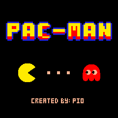

# Pac-Man Dongle Module 🟡

A self-playing Pac-Man for the [snake dongle](https://github.com/joaopedropio/snake-dongle)
hardware: a ZMK module that turns the dongle's 240x240 ST7789V panel into a
little arcade cabinet. Nobody drives it — Pac-Man hunts pellets on his own,
runs for a power pellet when he is cornered, chases the blue ghosts, and the
four ghosts use the classic scatter/chase targeting rules.



Same idea (and the same hardware definition) as the
[snake module](https://github.com/joaopedropio/snake-module), just a different game.

## Using it

Add the module to your zmk-config's `config/west.yml`:

```yaml
manifest:
  remotes:
    - name: zmkfirmware
      url-base: https://github.com/zmkfirmware
    - name: joaopedropio
      url-base: https://github.com/joaopedropio
  projects:
    - name: zmk
      remote: zmkfirmware
      revision: main
      import: app/west.yml
    - name: zmk-pacman
      remote: joaopedropio
      revision: main
  self:
    path: config
```

(`name:` is the GitHub repository name — change it if you publish this
under a different one.)

Then build the dongle with the `pacman_adapter` shield, next to your
keyboard's own dongle shield, in `build.yaml`:

```yaml
include:
  - board: nice_nano_v2
    shield: my_keyboard_dongle pacman_adapter
```

That is the whole setup: the shield chooses the custom status screen, so the
animation starts by itself once the dongle boots.

> The `pacman_adapter` shield describes the same panel, amplifier pins and
> action button as `snake_adapter`, and it ships the same
> `zmk,behavior-dongle-action` behaviour. Use one adapter or the other — do
> not pull both modules into the same build, or the behaviour will be
> defined twice.

### The action button

The dongle's action button (P0.31) is wired up through the sideband kscan, so
no keymap change is needed. How long it is held decides which of three things
it does:

| Held | What it does |
|---|---|
| up to 300 ms | swaps between the game and the dashboard |
| 300-600 ms | steps to the next theme |
| past 600 ms | mutes, or unmutes |

The two thresholds are `CONFIG_PACMAN_THEME_THRESHOLD` and
`CONFIG_PACMAN_MUTE_THRESHOLD`. The mute is saved, so a dongle switched off
muted comes back muted, and it silences whatever is sounding at the time.
Unmuting chirps, since a mute that says nothing either way gives you no way to
tell which state you are in. Setting `CONFIG_PACMAN_MUTE_THRESHOLD=0` leaves
the button with the first two presses.

The same three presses are available from the keymap: bind
`&dongle_action_behavior` to a key.

## Three screens

The panel is shared by three things, one at a time, and none of them is an
LVGL widget — they all draw straight to the display.

**The splash** goes up first: the wordmark, Pac-Man about to run into a ghost,
and who to blame. It stays for two and a half seconds
(`PACMAN_SPLASH_FRAMES` × `PACMAN_SPLASH_INTERVAL`), which is also what keeps
LVGL's first flush of its own empty screen off the game.

**The game** is the maze, and it owns the whole panel.

**The dashboard** is a grid of slots: `PACMAN_INFO_SLOT_MODE` picks the layout
and `PACMAN_INFO_SLOT_1` … `_6` say what goes in each one — `connectivity`,
`layer`, `theme`, `wpm`, `modifiers`, `battery` or nothing. Its header is a lap
of the maze in miniature, a ring of pellets with Pac-Man running it and a ghost
a few steps behind. Batteries take the strip along the bottom, one, two or
three of them per `PACMAN_BATTERY_SLOTS`.

`PACMAN_DEFAULT_SCREEN` decides which of the last two comes up after the
splash. Themes are the eleven colour schemes in `helpers/display.c`; the first
is yours to set with `PACMAN_THEME_*`, and the choice is remembered across
reboots. They colour the splash and the dashboard only — the maze keeps the
arcade's own colours whatever theme is up, set by the `PACMAN_*_COLOR` options
below.

The screens, their fonts and the slot machinery are ported from
[snake-module](https://github.com/joaopedropio/snake-module): same widgets,
same slot layout, same drawing helpers, with the artwork and the palette
redrawn for this one.

## Configuration

All options live in `Kconfig` and are prefixed with `PACMAN_`. Put them in your
`config/<shield>.conf` (or the shield's `pacman_adapter.conf`). These are the
ones worth knowing about; the rest colour the dashboard and are listed in
`Kconfig` with the same naming as snake-module's.

| Option | Default | What it does |
|---|---|---|
| `CONFIG_PACMAN_ROTATE_DISPLAY` | `0` | Panel rotation: 0, 90, 180 or 270. Only the rotation you pick is compiled in. |
| `CONFIG_PACMAN_FRAME_INTERVAL` | `33` | Milliseconds per frame (33 ≈ 30 fps). |
| `CONFIG_PACMAN_DEFAULT_SCREEN` | `game` | Which screen comes up after the splash. |
| `CONFIG_PACMAN_SOUND` | `y` | Drive the I2S amplifier at all. `n` compiles the whole sound path out. |
| `CONFIG_PACMAN_SOUND_VOLUME` | `80` | How loud, 0 to 100. 100 is unity; a limiter catches the peaks. |
| `CONFIG_PACMAN_SOUND_CONNECT` | `y` | Chirp when a keyboard connects or drops off. |
| `CONFIG_PACMAN_MUTE_THRESHOLD` | `600` | Milliseconds of hold that mute and unmute. `0` disables the mute press. |
| `CONFIG_PACMAN_SOUND_BASS_FLOOR_HZ` | `0` | Notes below this are doubled until they clear it, for a speaker that cannot reproduce them. Off by default: it changes the voicing. |
| `CONFIG_PACMAN_SOUND_SAMPLE_RATE` | `16000` | Samples per second; the nRF I2S clock picks the closest it can hit. |
| `CONFIG_PACMAN_WPM_SPEED` | `y` | Speed the game up while you type. |
| `CONFIG_PACMAN_WPM_SLOW` / `_FAST` | `20` / `60` | WPM thresholds for the 3px and 5px gears, either side of the 4px default. |
| `CONFIG_PACMAN_BG_COLOR` | `000000` | Background. |
| `CONFIG_PACMAN_WALL_COLOR` | `2121de` | Maze wall outline. |
| `CONFIG_PACMAN_WALL_FILL_COLOR` | `00003c` | Inside of the wall tubes, and the margin behind the border line. Set it to `000000` for hollow walls. |
| `CONFIG_PACMAN_WALL_FLASH_COLOR` | `f8f8f8` | Wall colour while the maze flashes at the end of a level. |
| `CONFIG_PACMAN_HOUSE_COLOR` | `6d6dff` | Ghost house outline. |
| `CONFIG_PACMAN_DOOR_COLOR` | `ffb8ff` | Ghost house door. |
| `CONFIG_PACMAN_PELLET_COLOR` | `ffb897` | Pellets and power pellets. |
| `CONFIG_PACMAN_PACMAN_COLOR` | `ffee00` | Pac-Man. |
| `CONFIG_PACMAN_GHOST_0..3_COLOR` | `ff0000`, `ffb8ff`, `00ffff`, `ffb852` | The four ghosts. |
| `CONFIG_PACMAN_FRIGHT_COLOR` | `2121de` | A frightened ghost. |

Colours are plain `rrggbb` strings (a leading `#` or `0x` is fine) and are
converted to RGB565 once at boot.

### Changing settings without reflashing

Kconfig is only the default. Every option in the table above — and every
colour, interval and threshold besides — can be stored on the dongle instead,
and what it stores wins on every boot after that. The action button already
does this for the theme and the mute; turning on the Zephyr shell adds a
`pacman` command for the other eighty-odd:

```
CONFIG_SHELL=y
```

The shell needs somewhere to talk. On a dongle that is the USB it is already
plugged into, which means a CDC ACM endpoint — build with `-S cdc-acm-console`,
or add the `zephyr,shell-uart` chosen node yourself. That snippet also renames
the USB device to "Zephyr USB console sample" and changes its product id, so
put yours back:

```
CONFIG_USB_DEVICE_PRODUCT="Cygnus"
CONFIG_USB_DEVICE_PID=0x615E
```

Then a serial terminal on `/dev/tty.usbmodem*` (macOS) or `/dev/ttyACM*`
(Linux):

```
uart:~$ pacman get
* theme                    3              live
  mute                     off            live
  screen                   game           next boot
  slot-mode                5-slot         next boot
  ...
  game-pac                 ffee00         live
  game-ghost-0             ff0000         live
  volume                   80             live
  frame-interval           33             live

uart:~$ pacman set game-ghost-0 39ff14
game-ghost-0 is now 39ff14
uart:~$ pacman set slot3 modifiers
slot3 will be modifiers from the next boot
uart:~$ pacman reset all
forgotten; the next boot takes what the firmware was built with
```

Colours, the volume, the frame interval and the typing thresholds change as
you type. The slot layout, the rotation and the splash cannot: every slot
widget sizes and allocates its scratch bitmap from the slot it was handed at
startup, and the splash is over before you can reach a prompt — so those are
stored and drawn on the next boot, which the shell tells you.

One wrinkle worth knowing: `theme-primary` and its three companions only reach
the dashboard when `CONFIG_PACMAN_USE_COMPLETE_CUSTOM_THEME=n`. With it on
(the default) theme 0 is painted from the individual dashboard colours
instead, and those are all settable in their own right.

### The configurator

`docs/configurator/index.html` is the same thing with colour pickers, and it
is live at **https://joaopedropio.github.io/configurator.html**. It is a single
static file with no build step and no server, so hosting it anywhere is a
copy: this repo keeps the canonical version, and the deployed copy is that
file with a header comment saying so.

It works out what to draw by asking the dongle — `pacman schema` answers with
one tab-separated line per setting — so the page never needs updating when the
firmware gains a setting, and it cannot show you a control for one that is not
there. WebSerial needs a secure context, which HTTPS-served Pages is, and a
browser that implements it: Chrome, Edge or Opera on desktop. Firefox and
Safari have no WebSerial and the page says so rather than half-working.

The shell and its USB backend cost about 28 KB of flash and 9 KB of RAM on
top of the same build without them; the settings table itself is another 3.5 KB
of flash whether the shell is compiled in or not. Leave `CONFIG_SHELL` off and
everything but that table goes away.

## How it plays itself

Pac-Man decides at every tile centre, with a breadth-first search over the
9x9 maze:

1. While the ghosts are blue, head for the closest one.
2. Otherwise, if a hunting ghost is within 8 tiles, run for a power pellet.
3. Otherwise, take the shortest path to the closest pellet — refusing to
   step within 3 tiles of a hunting ghost (walking distance, not
   as-the-crow-flies), giving up a tile of that clearance at a time when no
   comfortable route exists, and dropping it entirely once he has gone five
   seconds without eating. A stalemate looks worse than a death.
4. If every route is cut off, take the turn that puts the most maze between
   him and the nearest ghost.

The ghosts use the arcade rules: one chases Pac-Man, one aims four tiles
ahead of him, one mirrors the first ghost around a point in front of him, and
one only closes in from a distance; they alternate scatter and chase, reverse
when a power pellet is eaten, and go back to the house as a pair of eyes
after being eaten. Each sits out one frame in five, which is what makes a good
run possible at all.

Everyone moves 4 pixels a frame, 5 while you type fast and 3 while you are
idle — 120 pixels a second at 30 fps, twice what the arcade ran at. A power
pellet is worth turning round for: Pac-Man picks up a pixel a frame while the
ghosts are blue and they drop to half speed. Over a two-hour soak he clears a
maze about every 25 seconds and gets caught about every 135.

## How it is drawn

The maze is 9x9 tiles of 24px on a 240px panel. Walls and corridors are both
one tile thick — that is what the odd grid buys — but the walls are drawn as
1px tubes standing 4px off their tile, so a wall reads 16px and the corridor
beside it 32px, which leaves room for 28px sprites running down a 24px
corridor the way the arcade runs a 16px Pac-Man down an 8px one. On a panel
read at arm's length, how big the characters are matters more than how
elaborate the maze is.

No tile is spent on a border: the maze is walled in by a line drawn round it
in the leftover margin, with a gap wherever a row runs off into a tunnel.

`PM_TILE` in `game/pacman_core.h` sets the grid, and `PM_WALL_LINE`,
`PM_WALL_INSET`, `PM_WALL_R`, `PM_BORDER_GAP` and `PM_SPRITE` in
`game/pacman_render.h` set the drawing. Both headers explain what each one
trades against and which combinations do not work; a `_Static_assert` catches
the one that would put a pixel in two rounded corners at once.

What it costs:

| | |
|---|---|
| flash | ~9 KB |
| RAM | ~10 KB static (mostly a 9.6 KB blit scratch buffer and the pathfinder's arrays) |
| SPI traffic | ~3800 pixels/frame ≈ 7.4 KB/frame, about 225 KB/s at 30 fps — a fifth of what a 20 MHz link carries |
| LVGL widgets | none — the status screen is an empty `lv_obj` |

## Sound

A MAX98357A does the sound: an I2S amplifier with no registers to set up, so
three pins carry the sound and a fourth shuts it up. They run down the left
header in the order the breakout's own pads do, so the module solders on as one
straight run. (The dongle's piezo buzzer on P0.29 is not used at all any more —
it can stay soldered where it is and stay quiet.)

| MAX98357A | nRF52840 | |
|---|---|---|
| LRC | P0.02 | word select |
| BCLK | P1.15 | bit clock |
| DIN | P1.13 | the samples |
| SD | P1.11 | held high while something is playing, low the rest of the time |
| GAIN | — | floating is 9 dB; tie it straight to GND for 15 dB |
| GND, Vin | GND, VCC | 3.3 V works; 5 V is louder if the board has it |

Those pins are `i2s0_default` and the `pacman_amp` node in
`pacman_adapter.overlay`, which is the only place to change them if your wiring
differs. `CONFIG_PACMAN_SOUND=n` compiles all of it out, and so does leaving
the amplifier out of the devicetree.

**The game is silent.** Munching, dying and clearing the maze all went out of
the speaker once, and none of it was worth hearing on a loop for hours at a
desk — a dongle that chirps every time a pellet is eaten is a dongle you
unplug. What is left is the one thing the dongle knows that you cannot see:
two soft chime notes rising a fifth when a keyboard half reports in, D5 up to
A5, and the same two falling when one goes away. Each note takes 110 ms to
reach level and the second enters while the first is still ringing, so the pair
swells into the room rather than tapping at it.

Finding out is the awkward part. ZMK raises its split connection event on the
peripheral, and the dongle is the central, so it never sees one. What the
central does raise is a peripheral battery level of 0 on disconnect, and the
next real reading is the first thing heard from a half that has come back — so
that is the signal, the same one the battery readout already trusts. A half
sitting at a genuine 0% reads as gone, which is the price of using it. Nothing
sounds at power-on, when the halves connecting is the normal state of things
rather than news.

Behind those two chirps is a small polyphonic synth rather than a beeper, in
portable C in `widgets/game/pacman_sfx.c`, with the tunes written as notes in
`tools/tunes.py`. An instrument is two oscillators and an envelope; four voices
are mixed, and when a fifth note arrives the quietest gives way, not the
oldest. All integer: 16.16 phases, Q15 envelopes, one 256-entry sine table. A
soft limiter catches what stacks up, which is what lets the volume default to
80 rather than keeping a third of the range in reserve.

If you write a score of your own, the register matters more than the notes: a
20 mm cone radiates almost nothing below its own resonance, and a triangle wave
up at 1.3 kHz puts real energy exactly where the ear is sharpest. The chirps
ended up a sine with one quiet octave over it, sitting in the middle of the
speaker's range and easing in rather than being struck.
`CONFIG_PACMAN_SOUND_BASS_FLOOR_HZ` is there for a tune that does go low: it
doubles notes until they clear the floor, keeping the intervals.

`widgets/sound.c` is the part that has to know about Zephyr. It keeps blocks of
samples going to the I2S driver while a tune is sounding and stops the clock
when it is not, which is what keeps the amplifier from hissing between sounds.
It runs at priority 3, above ZMK's display thread — underneath it, a full
240x240 repaint starved the amplifier of whole blocks.

## Trying it without flashing

The game core and the renderer are plain C with no Zephyr or LVGL
dependencies, so they build and run on a host. The simulator blits into a
240x240 buffer, checks the invariants every frame (nobody inside a wall, and
the incremental redraw always matches a full repaint) and can dump PPM frames:

```sh
tools/sim/build.sh /tmp/pacman-sim
/tmp/pacman-sim 3000                        # 100 seconds, invariants only
/tmp/pacman-sim 640 2 /tmp/frames 40        # frames, every-nth, dir, from, speed
```

`docs/demo.gif` is those frames at 15 fps — which is the speed the dongle plays
it — with the splash held in front for the first two seconds.

The splash and the dashboard have their own harness, which stubs Zephyr out and
points the drawing helpers at a plain frame buffer. It shows the layout and the
artwork but not the slot contents, which come from ZMK state the host has none
of:

```sh
tools/uisim/build.sh /tmp/uisim
/tmp/uisim /tmp/frames        # splash.ppm and dashboard.ppm
```

And the sounds render to .wav, so they can be listened to before flashing:

```sh
tools/sfxsim/build.sh /tmp/sfxsim
/tmp/sfxsim /tmp/sounds 16000        # connect.wav and disconnect.wav
```

## Layout

```
boards/shields/pacman_adapter/
├── pacman_adapter.overlay      panel, backlight, amplifier and action button
├── Kconfig.defconfig           display + LVGL defaults for the shield
├── custom_status_screen.c      hands ZMK an empty screen, starts the timer
└── widgets/
    ├── pacman.c                display device, palette, LVGL timer, WPM speed
    ├── action_button.c         swaps screens, cycles themes, mutes
    ├── splash.c                the wordmark, the chase and the credit
    ├── logo.c                  the dashboard's animated header
    ├── frames.c                the boxes the slots are drawn in
    ├── configuration.c         Kconfig into runtime settings
    ├── theme.c                 the colour schemes and which one is current
    ├── battery_status.c        \
    ├── output_status.c          | the slot widgets: what ZMK knows,
    ├── layer_status.c           | drawn into whichever slot holds it
    ├── wpm.c                    |
    ├── modifier.c              /
    ├── sound.c                 the I2S amplifier, and what to play when
    ├── pacman_art.h            splash sprites (generated, see tools/sprites.py)
    ├── helpers/
    │   ├── display.c           the drawing engine: bitmaps, text, rectangles, themes, slots
    │   ├── fonts.h             six pixel fonts
    │   └── settings.c          the theme and the mute, remembered across reboots
    └── game/
        ├── pacman_core.c       maze, Pac-Man's pathfinding, ghost AI, rounds
        ├── pacman_render.c     sprites, tiles and dirty-rectangle blitting
        ├── pacman_sfx.c        the polyphonic synth
        └── pacman_tunes.h      the tunes (generated, see tools/tunes.py)
src/, include/, dts/            the zmk,behavior-dongle-action behaviour
tools/sim/                      host simulator for the game
tools/uisim/                    host preview for the splash and the dashboard
tools/sfxsim/                   renders the sounds to .wav on the host
tools/sprites.py                regenerates the splash artwork
tools/tunes.py                  regenerates the tunes
```

## Credits

Hardware definition, dongle action behaviour and the general shape of the
module come from [snake-module](https://github.com/joaopedropio/snake-module)
by João Pedro. Pac-Man is © Bandai Namco; this is a hobby homage running on a
keyboard dongle.

MIT licensed.
